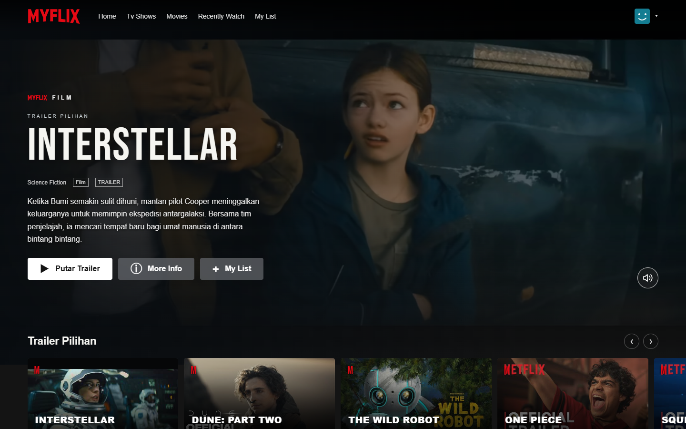
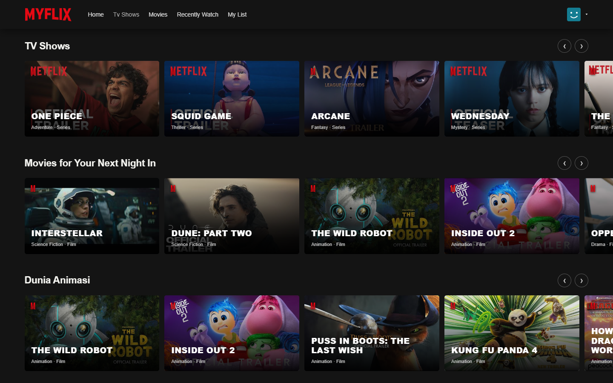
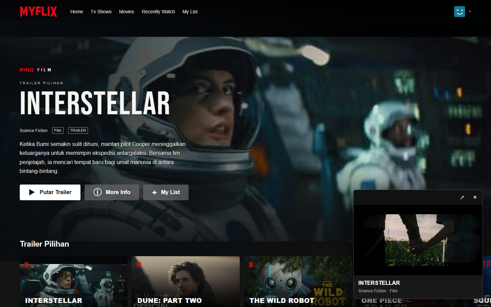
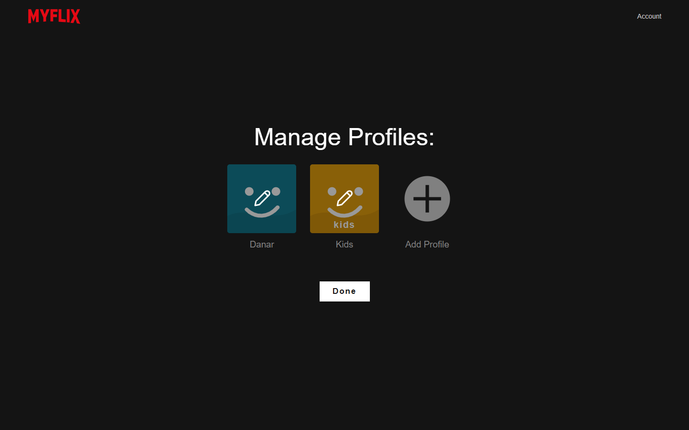

<div align="center">

# MYFLIX

### A Netflix-inspired streaming interface, built with React and TypeScript.

Cinematic previews. A curated catalog. Playback that stays with you.

**[Open the live demo](https://myflix-danarq.netlify.app)** — no login required.

**React 19 · TypeScript · Bun · Tailwind CSS 4 · Prisma · SQLite**

[Explore the interface](#screenshots) · [Run locally](#run-locally) · [Engineering decisions](#engineering-decisions) · [Architecture](AGENTS.md)

</div>



Myflix is a portfolio project focused on recreating the browsing experience of a streaming service: a video-led landing page, horizontal catalogs, movie details, profile management, and a floating trailer player. The project combines a working React interface with a Prisma/SQLite database foundation.

## Highlights

| Experience | Implementation |
| --- | --- |
| **Cinematic home page** | An Interstellar trailer plays behind the hero copy. Sound controls, muted autoplay fallback, and visibility-aware pausing keep the preview manageable. |
| **24 real titles** | 18 films and 6 series, with YouTube thumbnails, trailer links, and Indonesian descriptions. Five genre collections complement the film and series rows. |
| **Continuous trailer playback** | Switch between the full-page YouTube player and mini-player without restarting the video or losing its paused state. |
| **Movie discovery** | Scrollable carousels, native dialog details, and a browser-persisted My List. |
| **Profiles and account flows** | Up to five local profiles, custom avatar colors, active-profile selection, and demo membership management. |
| **Help center** | Searchable help articles, category filters, and expandable answers. |
| **Responsive UI** | Mobile navigation, adaptive cards and typography, keyboard labels, focus styles, and reduced-motion support. |

## Screenshots

Actual screenshots of the running app, captured at **1440 × 900**. Click an image to inspect it at full size.

### A catalog with room to explore



### Keep watching while browsing



### A familiar profile experience



## Engineering decisions

**Keep the player mounted across routes.** The YouTube player lives in `App.tsx`, outside the route tree. Changing between full and mini mode resizes the same container with a 320 ms CSS transition instead of creating a new iframe. This fixes the playback restart caused by route unmounting. The continuity guarantee applies to the YouTube player; the separate HTML5 fallback does not yet preserve playback across modes.

**Coordinate the hero and active player.** The hero uses the YouTube IFrame API to attempt autoplay with sound, retry muted when blocked, and pause when off-screen or when the tab is hidden. Opening a detail dialog or another player removes the hero preview, preventing overlapping audio.

**Separate a usable frontend from backend preparation.** The UI reads typed catalog data and persists local preferences in browser storage. Prisma models movies, profiles, saved-list relations, membership, help content, and a demo account in SQLite. A movie-only upsert script updates catalog records without resetting profiles or accounts.

**Keep the code easy to navigate.** Route-level screens live in `src/pages`, reusable UI in `src/components`, shared data in `src/data`, and styles in `src/styles`. The application uses Bun's development server and build pipeline rather than an additional bundler configuration.

## Run locally

Prerequisites: [Bun](https://bun.sh/) and a modern browser. An internet connection is needed for YouTube trailers, thumbnails, and externally hosted fonts. No YouTube API key is required.

```sh
git clone https://github.com/DanarQ/Netflix-clone.git
cd Netflix-clone
bun install
bun run dev
```

Open **http://localhost:3000**. The frontend works without setting up SQLite because its current data flow is client-first.

### Set up the local database

Create a `.env` file in the project root:

```dotenv
DATABASE_URL="file:./dev.db"
```

Then apply the checked-in migration and seed the database:

```sh
bunx prisma migrate deploy
bun run db:generate
bun run db:seed
```

SQLite data is stored in `prisma/dev.db` and excluded from Git. The full seed creates initial catalog/help data, default profiles, demo membership, and a demo account with a bcrypt password hash. It also updates default profiles and resets the seeded account's password when rerun; it is intended for local development, not production account provisioning.

### Update the catalog

1. Edit `src/data/movies.ts`, keeping IDs unique and stable.
2. Record trailer sources in [the catalog source notes](docs/movie-sources.md).
3. Run `bun run db:seed:movies` to sync movie records into SQLite.

Editing SQLite alone does **not** change the current UI. Seed scripts upsert records; removing a title from the source file does not delete its existing database row.

| Command | Purpose |
| --- | --- |
| `bun run dev` | Development server with hot reload |
| `bun run build` | Generate the production browser bundle in `dist/` |
| `bun run start` | Run the Bun application server with production mode enabled |
| `bunx tsc --noEmit` | Check TypeScript types |
| `bun run db:seed:movies` | Insert or update only the catalog |
| `bun run db:studio` | Inspect local data with Prisma Studio |
| `bun run db:migrate -- --name your_change` | Create a migration after editing the schema |

`bun run start` serves through `src/index.ts`; it is not a static server for `dist/`. A deployment needs to account for this distinction and client-side route fallback.

## Deploy the demo to Netlify Free

Run `bun run build`, then upload the `dist` folder through Netlify's manual deployment flow. Alternatively, import this repository: `netlify.toml` sets the build command and publish directory. Use the Free plan and the included `netlify.app` address; no paid plan or purchased domain is needed for this demo.

The build includes an SPA rewrite (`_redirects`) and root-relative asset URLs so routes such as `/watch/interstellar` and `/account/profiles` work when opened directly. React startup supports both Bun hot reload and the static production build.

No database credentials or SQLite upload are needed. The demo uses the bundled catalog and each visitor's browser storage. Netlify Free has usage limits and may pause the site when exhausted.

Live demo: **[myflix-danarq.netlify.app](https://myflix-danarq.netlify.app)**. Published through Netlify Drop on September 9, 2026. The public home page and direct access to `/account/profiles` were verified in Chrome.

## Project map

```text
src/
  App.tsx              Routes, persistent YouTube player, scroll restoration
  index.ts             Bun HTTP server
  components/          Hero, navigation, carousels, dialogs, players, avatars
  pages/               Home, watch, profiles, account, help center
  data/                Typed catalog, profiles, help articles
  styles/              Global, home/player, account, and help styles
prisma/
  schema.prisma        SQLite data model
  migrations/          Versioned database schema
  seed.ts              Full local-development seed
  seed-movies.ts       Catalog-only upserts
docs/
  movie-sources.md      Trailer sources and catalog notes
  screenshots/         Real interface captures used in this README
```

See [AGENTS.md](AGENTS.md) for the detailed route map, storage keys, and development conventions.

## Validation and current scope

Verified during development:

- Production build and TypeScript checks pass.
- All 24 catalog entries have unique IDs and their fields match their SQLite records after seeding.
- Browser checks confirm that the YouTube mini-player continues playback after resizing and retains a paused position.
- Hero autoplay fallback, sound controls, catalog layouts, and profile screens have been checked in a real browser.

This is a **frontend portfolio demo with a database foundation**, not a production streaming platform. Videos are YouTube trailers, not full movies. Authentication, database-backed catalog endpoints, real payments, and watch-history persistence are not implemented. My List is currently browser-wide rather than profile-specific. Trailer availability and embedding permissions depend on YouTube and the uploader; not every trailer has been playback-tested individually.

## Next steps

- Connect the catalog and profile flows to Prisma-backed endpoints.
- Add authentication and profile-specific saved lists.
- Persist watch history and playback progress.
- Add repeatable browser regression tests for the core playback flows.

## Credits

Built by [Danar Qusyairi](https://github.com/DanarQ). Netflix-inspired visual design for learning and portfolio demonstration; not affiliated with or endorsed by Netflix. Movie artwork, names, and trailers belong to their respective rights holders. [Trailer sources](docs/movie-sources.md).
